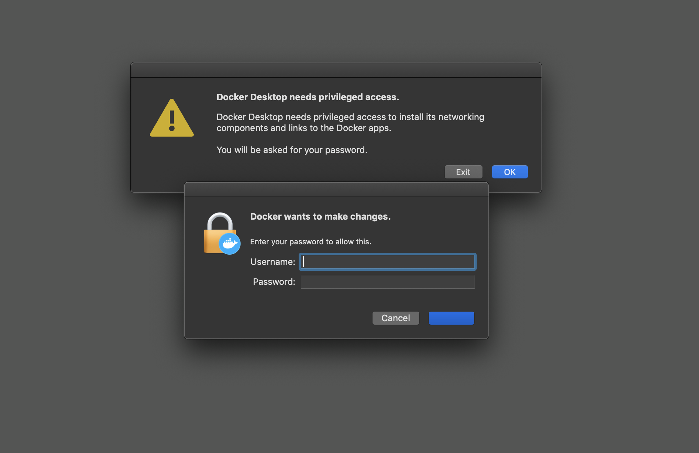
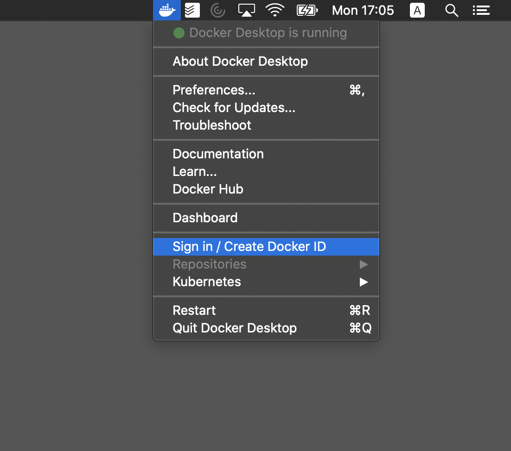

# productionize - deploy ML models directly from Python [WIP] 

<i><code>productionize</code> is an open-source lightweight ML deployment tool. 
You can containerize, deploy and ship your model, without ever 
having to leave your beloved Python.</i>

***

## Installation

<code>productionize</code> is a Python library, which is hosted on PyPi. Currently, the functions are only supported on <b>macOS</b>. On the <b>darwin</b> platform you can therefore download the package using <code>pip</code>.

    pip install productionize

## Usage

Once the library is properly installed from PyPi, you can source it using your standard python import command. The core
of the library are it's three main classes, those can be imported as follows:

    # import lib
    from productionize import workbench, product

Once the main classes are sourced, you can setup your very own workbench on your local machine. The workbench consists of several tools:

<ul>
    <li>Docker: a container technology, which helps us to build Docker container, which are the quasi-standard in Machine Learning deployment. You can read more about Docker <a href="https://docs.docker.com/">here</a>.</li>
    <li>VirtualBox: a driver that is needed to create a VM on you local machine to host the Kubernetes cluster, which is at the heart of the workbench. You can read more about VirtualBox <a href="https://www.virtualbox.org/">here</a></li>
    <li>Kubectl: a cli which allows you to interact with Kubernetes. You won't have to do that, but <code>productionize</code> is running Kubernetes commands in the background.</li>
    <li>Minikube: a local implemenation of Kubernetes. Minikube runs on a VM, which is administrated by Virtualbox.</li> 
</ul>

To setup the workbench, these tools need to be installed. You can do this, by simple running the setup() method of the workbench class. Once initiated you can call the method.

    # initiate class
    cluster = workbench()

    # install and setup components
    cluster.setup()

To fire up the entire workbench, you first need to login to Docker Desktop. This is installed for you, however, you need to have it running. You can easily do this, just search on your computer - if you have a Mac you just use spotlight search - for Docker and start the application.

  

Next you will have to sign in. If you don't have an account already, you can create one for free at <a href="https://hub.docker.com>"Docker Hub</a>. Which is a lot like GitHub, just for containers.

  

Once you did this, you are good to go on. You can now start the cluster using the start_cluster() method. This method allows you to set the resource quota for the cluster. Default are two CPUs and 2GB of memory.

    # start the cluster
    cluster.start_cluster(cpus = '2', memory = '2G')

To stop the cluster you can simply use the stop_cluster() method. This one just idles the cluster, but doesn't remove all the components.

    # stop the cluster
    cluster.stop_cluster()

To cleanly uninstall all the components, you can just run the uninstall() method and even specify which components to delete. The default is, that the components that existed on your machine before will be not removed.

    # cleanly uninstall cluster components
    cluster.uninstall(docker = None, kubectl = None, virtualbox = None, minikube = None, report = True)

