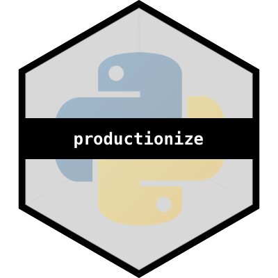

# productionize - deploy ML models directly from Python [WIP] 

***

<i><code>productionize</code> is an open-source lightweight ML deployment tool. 
You can containerize, deploy and ship your model, without ever 
having to leave your beloved Python.</i>

***

## Installation

<code>productionize</code> is a Python library, which is hosted on PyPi. Currently, the functions are only supported on <b>macOS</b>. On the <b>darwin</b> platform you can therefore download the package using <code>pip</code>.

    pip install productionize

Once the library is properly installed from PyPi, you can source it using your standard python import command. The core
of the library are it's three main classes, those can be imported as follows:

    # import lib
    from productionize import workbench, product

